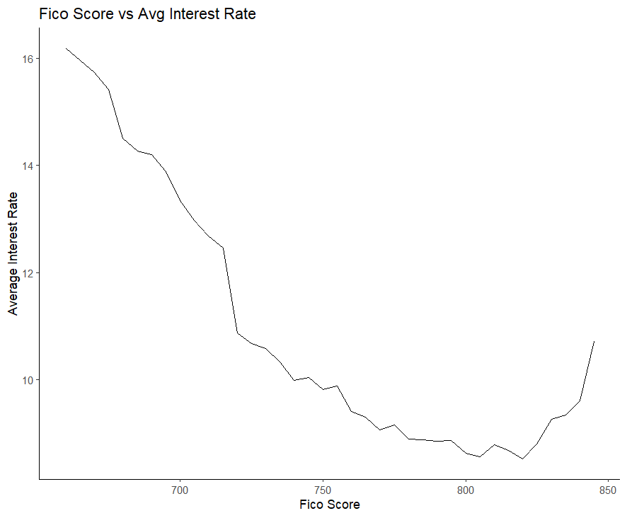
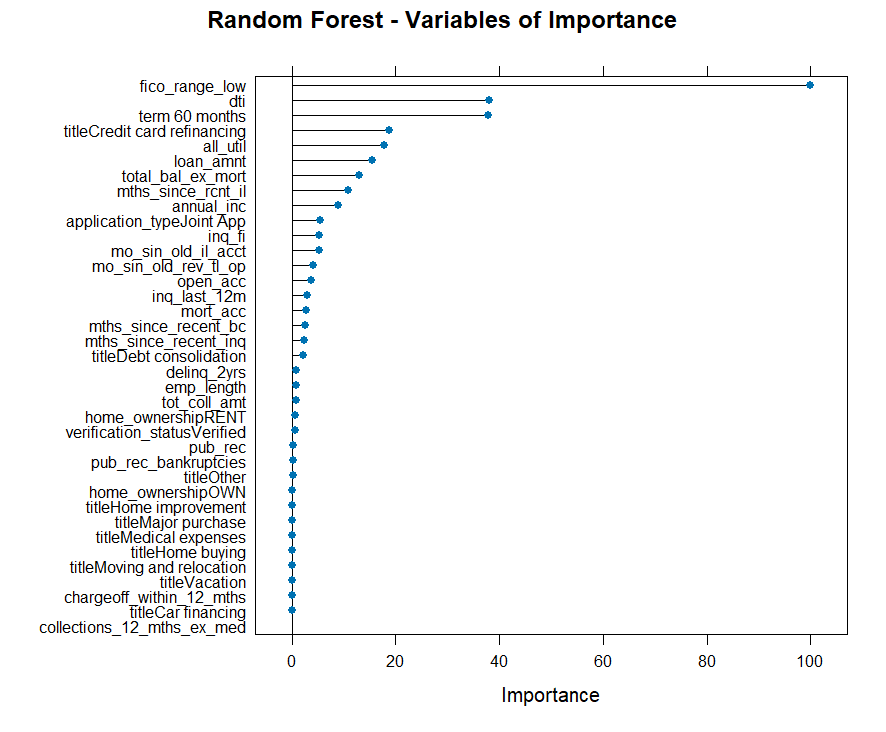
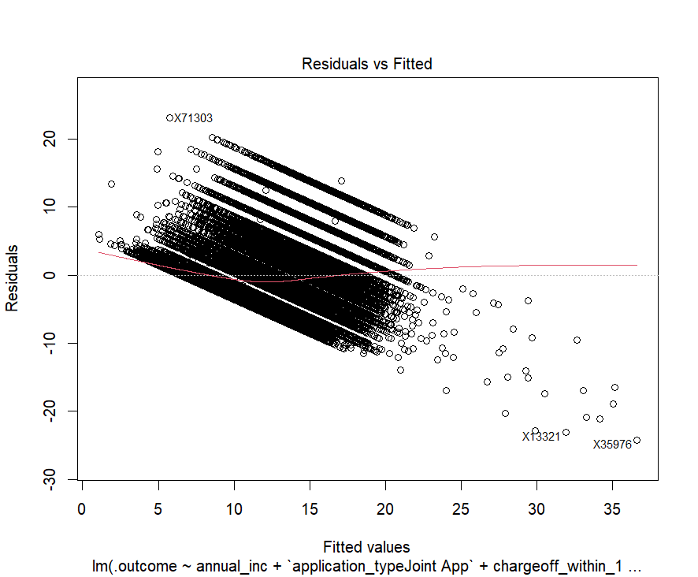
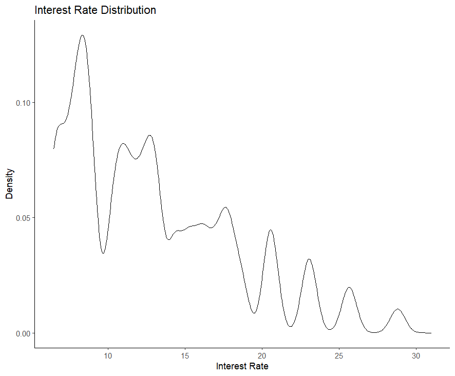

# LendingClub Interest Rate Prediction

Predicting loan interest rates from borrower and loan characteristics available at origination, using Linear Regression and Random Forest models. The Random Forest model achieved an R² of **0.40** with RMSE of **4.05** percentage points, improving on the linear baseline by ~9%.

**Course:** Georgetown MSBA — OPAN 6604: Predictive Analytics  
**Team:** Emma Cranmer, Mike Johnson, Dylan Lowndes, Izzy Mendoza, Lola Oshodi  
**Award:** 1st Place, Course Hackathon Competition

---

## Problem Statement

LendingClub was a peer-to-peer lending platform that connected individual borrowers with investors (2007–2020). The platform assigned an interest rate to each loan based on assessed creditworthiness. This project builds a predictive model that estimates a loan's interest rate using **only information available at origination** — simulating the task a lender faces in real-time underwriting.

Accurately predicting interest rates matters both for investors pricing risk and for understanding which borrower attributes most influence loan cost.

---

## Dataset

- **Source:** LendingClub public loan data, 2007–2020
- **Training set:** ~100,000 loans (`data/raw/LC_train.csv`)
- **Test set:** ~10,000 loans (`data/raw/LC_test.csv`)
- **Target variable:** `int_rate` — the annual interest rate on the loan (%)
- **Data dictionary:** `docs/LCDataDictionary.xlsx`

Key features at origination include: loan amount, term, FICO score, DTI ratio, employment length, annual income, home ownership, verification status, credit utilization, loan purpose, and credit history metrics.

Several variables reflect post-origination loan status (`loan_status`, `revol_bal`, etc.) and were excluded to prevent data leakage.

---

## Methodology

### Data Preparation
- **Leakage prevention:** Dropped 5 "current" (post-origination) columns
- **High-cardinality features:** Removed `emp_title` (32K distinct values) and `purpose` (redundant with `title`)
- **Missing values:** Sentinel imputation for credit history timing features (−1 = "never had account"); `emp_length` NAs treated as `< 1 year`; `dti` and `all_util` NAs filled with 0
- **Ethical exclusions:** Removed `addr_state` and `zip_code` — location should not drive creditworthiness determinations, and geographic features open the door to discriminatory lending patterns
- **Outlier removal:** Excluded FICO scores ≥ 800 (sparse data, noisy averages), credit utilization ≥ 100%, and the top 5% of annual incomes
- **Train/dev split:** 90/10 stratified split, with the held-out 10% used for model evaluation

### Exploratory Analysis
- Interest rate follows a multimodal distribution (peaks at ~9%, ~11%, ~13%), reflecting LendingClub's discrete rate-tier pricing
- Strongest numeric predictors: FICO score (r = −0.43 with interest rate) and credit utilization (r = +0.32)
- 60-month loans carry meaningfully higher rates than 36-month loans
- Verified loan applications tend to have slightly higher rates (counterintuitive, but consistent with riskier borrower profiles seeking verification)

### Models Trained
| Model | Description |
|---|---|
| Linear Regression | Stepwise AIC feature selection (backward), 5-fold CV; multicollinear variables excluded |
| Random Forest | 100 trees, permutation importance, 3-fold CV via `ranger` |

### Evaluation
Models were evaluated on the held-out dev set using RMSE, MAE, and R².

---

## Results

| Model | RMSE | MAE | R² |
|---|---|---|---|
| Linear Regression | 4.37 | 3.38 | 0.31 |
| **Random Forest** | **4.05** | **3.07** | **0.40** |

The Random Forest outperforms the linear model across all metrics. Its advantage is partly explained by LendingClub's discrete rate-tier system: the linear model produces banded residuals (visible in `reports/figures/lm_residuals_fitted.png`) that the tree-based model handles more naturally.

### Key Findings

- **FICO score is by far the most important predictor** — permutation importance ranks it at 100, more than 2.5× the next variable (DTI at ~40). This aligns with how lenders historically weight credit scores.
- **Debt-to-income ratio (DTI) and loan term** are the next most influential features.
- **Loan purpose matters at the margins** — "credit card refinancing" is a notable predictor but most purpose categories have near-zero importance.
- **Geographic features were deliberately excluded** — including state or zip code would likely improve model fit, but introduce proxies for race and socioeconomic status that are inappropriate for lending decisions.

---

## Repository Structure

```
LendingClub/
├── data/
│   ├── raw/
│   │   ├── LC_train.csv          Training set (~100K loans)
│   │   └── LC_test.csv           Test set (~10K loans, no int_rate)
│   └── processed/
│       └── dev_predictions.csv   Dev split with all model predictions attached
├── docs/
│   └── LCDataDictionary.xlsx     Official LendingClub variable definitions
├── notebooks/
│   ├── 01_exploration.R          Exploratory analysis, feature engineering, PCA, ANN experiments
│   └── 02_modeling.R             Final clean pipeline: preprocessing, LM, RF, evaluation
├── reports/
│   ├── figures/                  22 EDA and model diagnostic plots (PNG)
│   ├── correlation_matrix.csv    Pairwise Pearson correlations for numeric features
│   ├── model_metrics.csv         Final LM vs RF comparison table
│   └── test_predictions.csv      RF predictions on the holdout test set (10K rows)
└── project_1.Rproj               RStudio project file
```

---

## Getting Started

**Requirements:** R ≥ 4.0 with the following packages:

```r
install.packages(c("tidyverse", "caret", "fastDummies", "cluster",
                   "factoextra", "corrplot", "ranger", "Metrics"))
```

**To reproduce the analysis**, open `project_1.Rproj` in RStudio and run `notebooks/02_modeling.R`. The script uses relative paths and expects the working directory to be the project root.

**To explore the full analysis** (including PCA and ANN experiments), run `notebooks/01_exploration.R`.

---

## Selected Figures

| | |
|---|---|
|  |  |
| FICO score vs. average interest rate — strong negative relationship | Random Forest variable importance — FICO dominates |
|  |  |
| Linear model residuals show banding from discrete rate tiers | Multimodal interest rate distribution reveals LendingClub's tier pricing |
